```{r setup, include=FALSE}
knitr::opts_chunk$set(echo = FALSE)
```

## Topo map

```
gmt grdimage dem.grd -JM24 -B0.25i0.25i -Xc -Yc -Cmby.cpt -V > colored.ps
gmt grdgradient dem.grd -Ghillshade.grd -A345 -Ne0.6 -V
gmt grdhisteq hillshade.grd -Ghillshade-hist.grd -N -V
gmt grdinfo hillshade-hist.grd
gmt grdmath hillshade-hist.grd 5 DIV = hillshade-int.grd
gmt grdimage dem.grd -JM24 -B0.25i0.25i -Xc -Yc -Ihillshade-int.grd -Cmby.cpt -V > shaded.ps
```

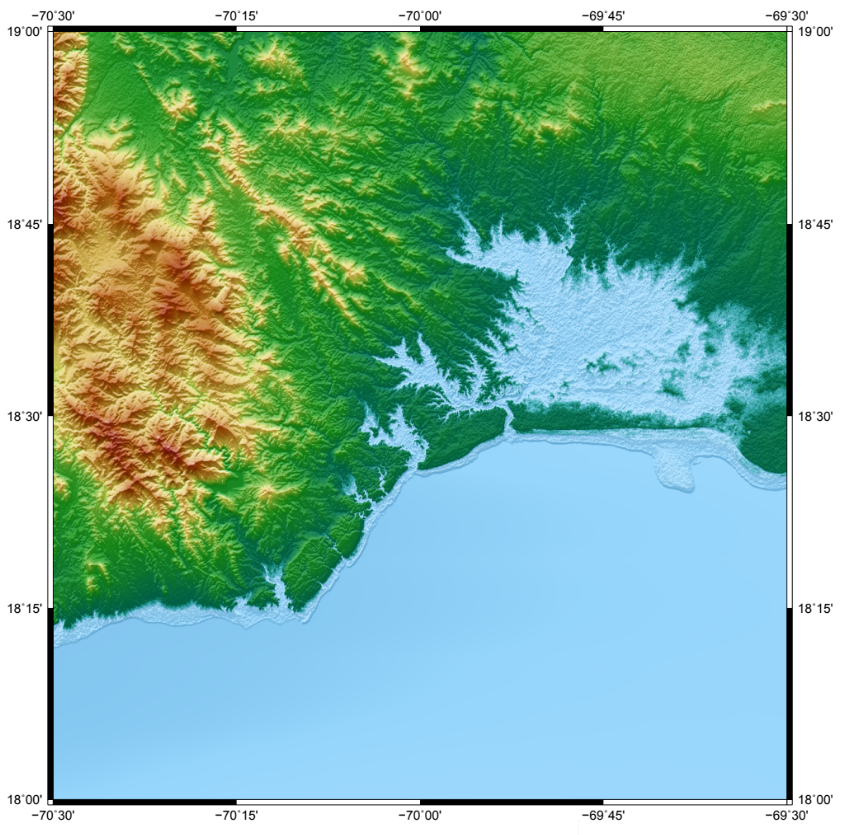

# 2-pass processing with GMTSAR

# 2019-08 -> 2020-03 <br> All subswaths

## **Sentinel images <br> (AOI: Santo Domingo City, <br> Dominican Republic):**

S1A_IW_SLC__1SDV_20190806T224456_20190806T224523_028455_033731_BD53
S1A_IW_SLC__1SDV_20200309T224455_20200309T224522_031605_03A45F_C35A

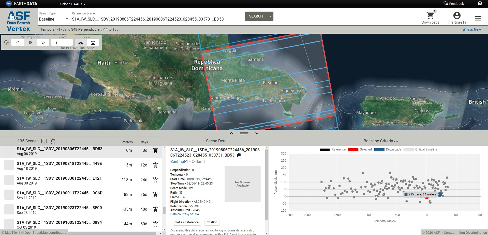

## Script

```
# Executed
time p2p_S1_TOPS_Frame.csh \
  S1A_IW_SLC__1SDV_20190806T224456_20190806T224523_028455_033731_BD53.SAFE \
  S1A_OPER_AUX_POEORB_OPOD_20190826T120644_V20190805T225942_20190807T005942.EOF \
  S1A_IW_SLC__1SDV_20200309T224455_20200309T224522_031605_03A45F_C35A.SAFE \
  S1A_OPER_AUX_POEORB_OPOD_20200329T120846_V20200308T225942_20200310T005942.EOF \
  config.s1a.txt vv 1
# real	472m6.076s
# user	528m19.833s
# sys	1m21.343s
```

## Wrapped phase

```
library(rgdal)
library(raster)
setwd(paste0(
  '/media/jose/BUDOCS/gmtsar_course_images/processed/',
  'Santo_Domingo_all_subswaths_processed_20190806T224456_20200309T224455',
  '_based_on_topex_gmtsar_example_S1A_SLC_TOPS_LA/merge/')
f <- raster(readGDAL('phasefilt_ll.grd'))
f <- raster(readGDAL('corr_ll.grd'))
c[c<0.2] <- NA
fm <- f*(c>=0.2)
extent(fm)[1:2] <- extent(fm)[1:2] - 360
writeRaster(fm, 'phasefilt_mask_ll.tif')
```

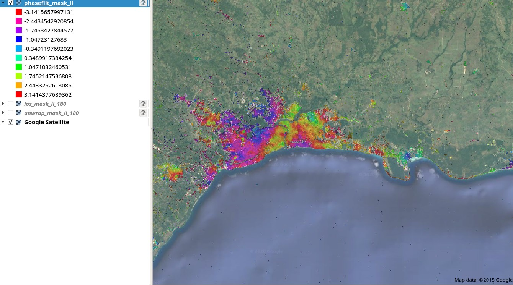

## Unwrapped phase

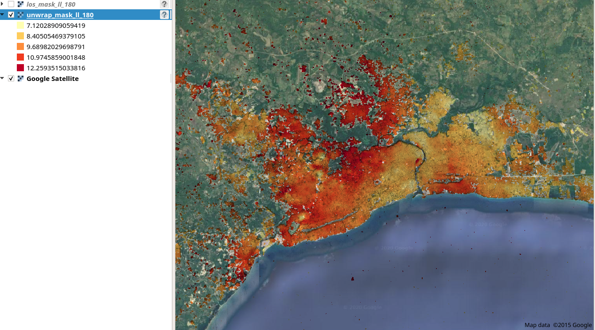

## LOS map

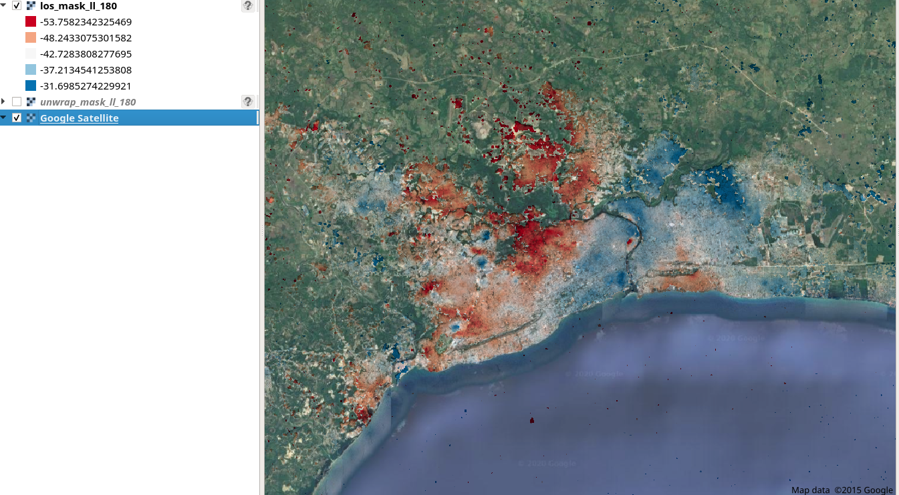

## CORS RDSD

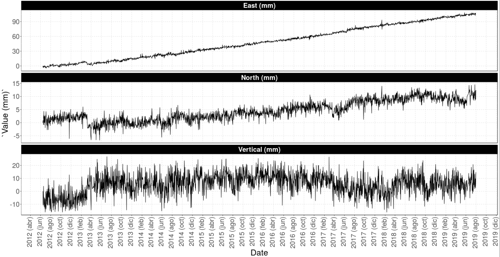

# 2016-03 -> 2018-01 <br> One subswath

## **Sentinel images <br> (AOI: Santo Domingo City, <br> Dominican Republic):**

S1A_IW_SLC__1SDV_20160318T224427_20160318T224457_010430_00F779_D477
S1A_IW_SLC__1SDV_20180119T224443_20180119T224510_020230_022857_A730


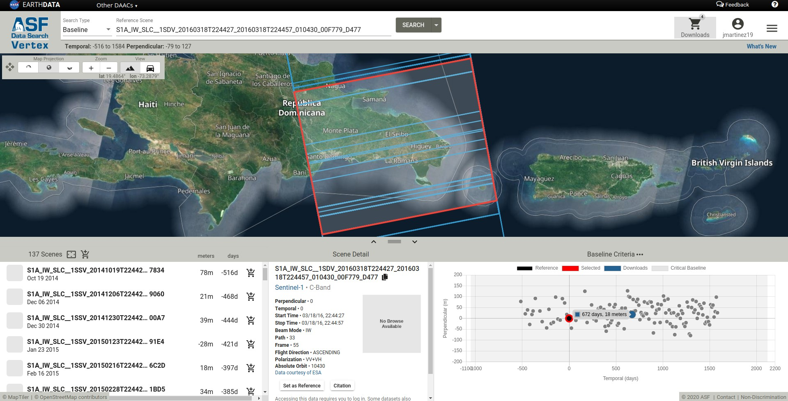

## Script

```
# Executed
mkdir sd1618
cd sd1618
mkdir topo
mkdir raw
cd raw/
ln -s ../orig/*.tiff .
ln -s ../orig/*.xml .
ln -s ../orig/*.EOF .
ln -s ../topo/dem.grd .
time align_tops.csh \
   s1a-iw1-slc-vv-20160318t224427-20160318t224455-010430-00f779-004 \
   S1A_OPER_AUX_POEORB_OPOD_20160407T121449_V20160317T225943_20160319T005943.EOF \
   s1a-iw1-slc-vv-20180119t224445-20180119t224510-020230-022857-004 \
   S1A_OPER_AUX_POEORB_OPOD_20180208T120528_V20180118T225942_20180120T005942.EOF \
   dem.grd 2>&1 | bash -c 'trap "" INT; awk "{print strftime(\"%c - \") \$0}"' | tee log
# real	2m15.453s
# user	2m43.789s
# sys	0m2.241s
```

##

```
cd ..
rm -r F1/raw
mkdir F1
cd F1
ln -s ../config.s1a.txt .
mkdir raw
cd raw
ln -s ../../raw/*F1* .
cd ..
mkdir topo
cd topo
ln -s ../../topo/dem.grd .
cd ../..

cd F1
time p2p_S1_TOPS.csh S1_20160318_224427_F1 S1_20180119_224445_F1 config.s1a.txt 2>&1 \ 
   | bash -c 'trap "" INT; awk "{print strftime(\"%c - \") \$0}"' | tee log
# real	26m2.930s
# user	26m12.301s
# sys	0m7.845s
```

## Wrapped phase

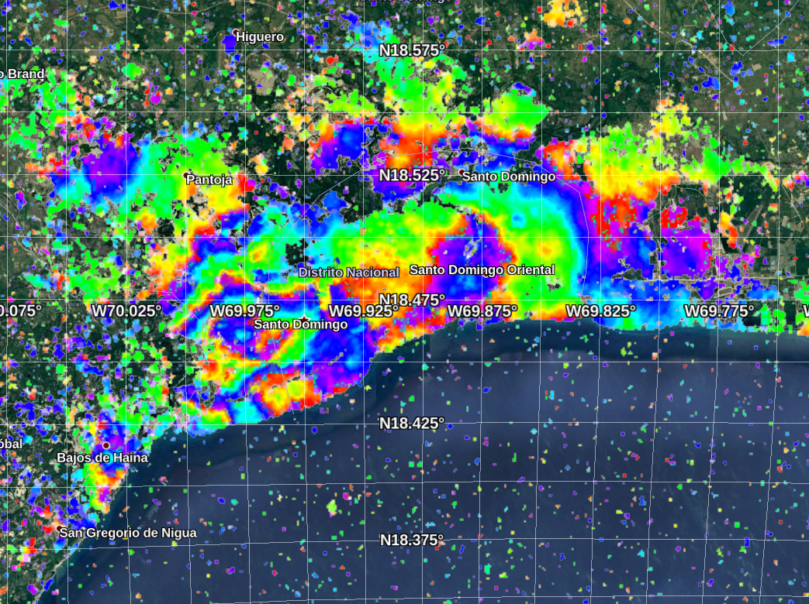

## Wrapped phase (SNAP)

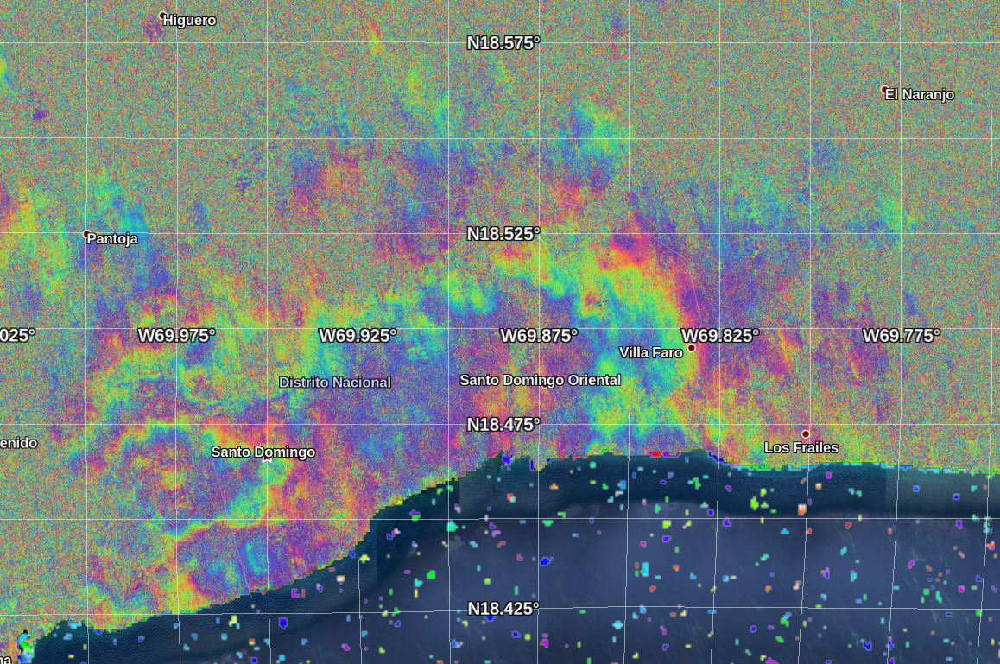

## Unwrapping error (stage 5 included, snaphu_threshold = 0.2)

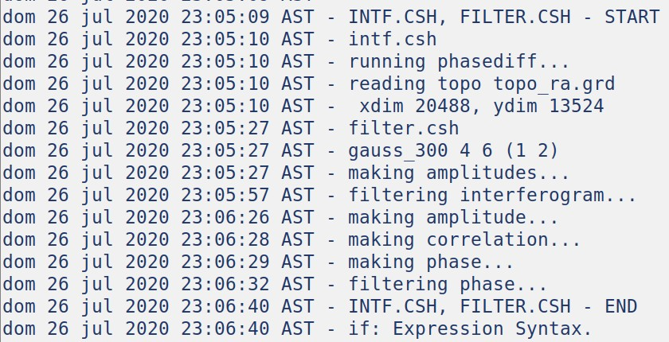

## LOS map (SNAP)

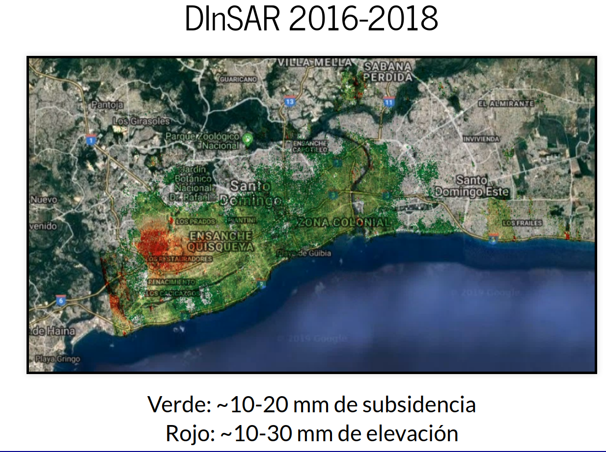

## CORS RDSD (vertical component)

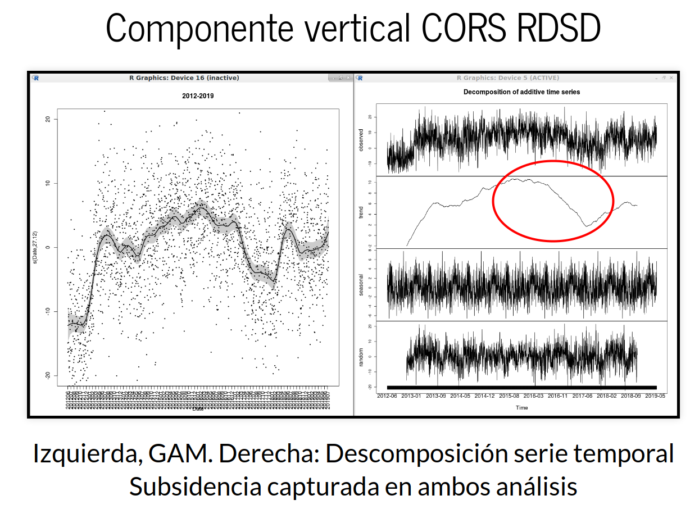

## All subswaths

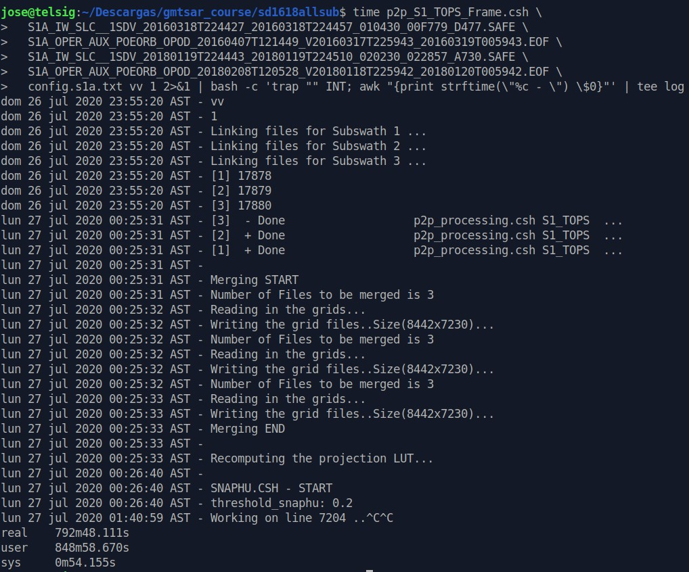

# References

## 
